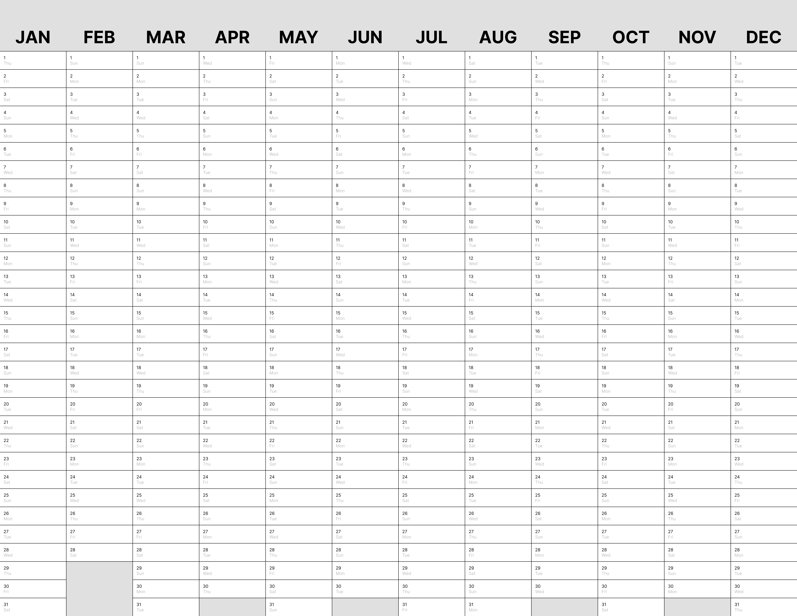

# `calendar`



A yearly calendar planner that fits perfectly on US Letter paper.
You can scale it up or down using [`pdfposter`](https://pdfposter.readthedocs.io/en/stable/index.html):

```
❯ pdfposter -m letter -p 4x4letter calendar.pdf output.pdf
```

I included my `output.pdf` for a 4x scaling that results in a poster about 42x33" in size.
